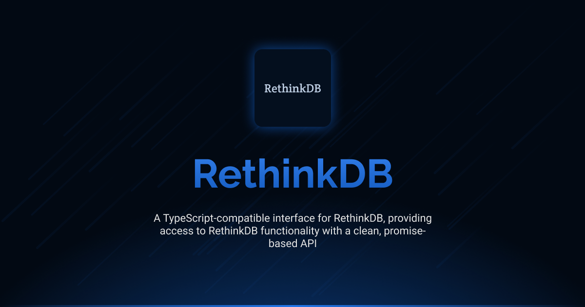

# Interface RethinkDB

[](LICENSE.md)
[](https://github.com/antelopejs/antelope)

A direct interface to RethinkDB functionality. Interface RethinkDB provides access to RethinkDB for executing queries with a clean, promise-based API and full TypeScript support.

## Installation

```bash
ajs module imports add rethinkdb@beta
```

## Documentation

Detailed documentation is available in the `docs` directory:

- [Index](./docs/index.md) - Core functionality and usage examples

## Current Status

This is the development version (`beta`) of the Interface RethinkDB. It is currently in pre-release stage and may undergo changes before the final release. The interface is not considered stable for production use without understanding that breaking changes may occur.

## Versions

| Version | Link                                                                                                     | Status                                        |
| ------- | -------------------------------------------------------------------------------------------------------- | --------------------------------------------- |
| beta    | [rethinkdb@beta](https://github.com/AntelopeJS/rethinkdb/tree/main/.antelope/output/rethinkdb/beta.d.ts) | Waiting validation from community to go in v1 |
| 1       | _Not yet released_                                                                                       | Planned stable release                        |

## License

This project is licensed under the Apache License 2.0 - see the [LICENSE](LICENSE) file for details.
